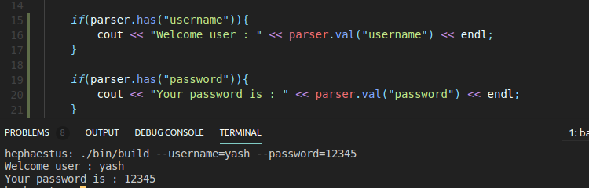

## Argument Parser C++

a miniature argument parser for c++

### Installation

- Intended to be used with the [cpp template](https://github.com/YashKumarVerma/cpp-template) as a pluggable module.
- Simply copy the `includes/parser` directory to your cpp project built using the **_cpp template_**

### Usage

- Load the module using `#include"./../includes/parser/parser.h"` in your `app.cpp` file.
- Access the number of arguments, and character array with arguments using `int main(int argc, char* argv[])`
- Create a parser instance, and feed it the `argc` and `argv` values `Parser parser(argc, argv);`
- Now check if a handle is passed or not using the `parser.has("handle")` method
- To get the value of a handle, use `parser.val("handle")` method

### Sample

- Sample code for demonstration is available in [`app.js`](./../source/app.cpp)

---

**Author**: [Yash Kumar Verma](http://github.com/yashkumarverma)
